# Master Network Forensics Report

## Executive Summary

The master synthesizer reviewed 52 bundle-level reports and consolidated 83 reportable findings. The most recurrent finding categories were External Sensitive Access, Suspicious TLS Session, Potential Data Exfiltration. The most frequently affected entities included 88.214.25.115->10.128.239.57:3389, 194.165.17.11->10.128.239.57:3389, 91.238.181.7->10.128.239.57:3389, 91.238.181.10->10.128.239.57:3389, 91.238.181.8->10.128.239.57:3389, and the most recurrent source hosts included 10.128.239.57, 88.214.25.115, 194.165.17.11, 91.238.181.7, 91.238.181.10. Cross-bundle correlation identified 10 campaign-level finding(s), indicating persistence beyond a single bundle.

## Scope

- Bundles analyzed: 52
- Total reportable bundle findings: 83
- Campaign-level findings: 10
- Human review required count: 11
- First observed timeline event: 2026-04-16T18:55:06.652613Z
- Last observed timeline event: 2026-04-16T18:55:07.057349Z

## Recurrent Finding Categories

- External Sensitive Access: 43
- Suspicious TLS Session: 29
- Potential Data Exfiltration: 9
- Suspicious DNS Activity: 1
- Known Bad IP Communication: 1

## Most Frequent MITRE ATT&CK Techniques

- T1133: 43
- T1078: 43
- T1021.001: 43
- T1071: 30
- T1573: 29
- T1048: 9
- T1041: 9
- T1567: 9
- T1071.004: 1
- T1105: 1

## Most Frequent Source Hosts

- 10.128.239.57: 233
- 88.214.25.115: 10
- 194.165.17.11: 10
- 91.238.181.7: 8
- 91.238.181.10: 8
- 91.238.181.8: 7
- 194.165.16.167: 6
- 179.60.146.33: 6
- 179.60.146.32: 6
- 179.60.146.36: 6

## Most Frequent Destination Hosts

- 10.128.239.57: 246
- 51.91.79.17: 25
- 179.60.146.33: 11
- 179.60.146.36: 11
- 195.211.190.189: 11
- 194.165.17.11: 8
- 91.238.181.7: 7
- 141.98.83.10: 7
- 88.214.25.115: 5
- 179.60.146.32: 5

## Most Frequently Affected Entities

- 88.214.25.115->10.128.239.57:3389: 10
- 194.165.17.11->10.128.239.57:3389: 10
- 91.238.181.7->10.128.239.57:3389: 8
- 91.238.181.10->10.128.239.57:3389: 8
- 91.238.181.8->10.128.239.57:3389: 7
- 194.165.16.167->10.128.239.57:3389: 6
- 179.60.146.33->10.128.239.57:3389: 6
- 179.60.146.32->10.128.239.57:3389: 6
- 179.60.146.36->10.128.239.57:3389: 6
- 147.45.112.181->10.128.239.57:3389: 5
- 179.60.146.37->10.128.239.57:3389: 5
- 45.227.254.152->10.128.239.57:3389: 4
- 141.98.11.8->10.128.239.57:3389: 4
- 136.144.42.225->10.128.239.57:3389: 4
- 92.255.85.173->10.128.239.57:3389: 4

## Bundle-by-Bundle Summary

- bundle_2025-11-18_nested_overlap: findings=1, events=214, pcaps=6, top_finding=External Sensitive Access, top_confidence=1.0
- bundle_2025-11-22_nested_overlap: findings=0, events=36, pcaps=1, top_finding=None, top_confidence=N/A
- bundle_2025-11-23_nested_overlap: findings=0, events=24, pcaps=1, top_finding=None, top_confidence=N/A
- bundle_2025-11-24_nested_overlap: findings=0, events=36, pcaps=1, top_finding=None, top_confidence=N/A
- bundle_2025-11-28_nested_overlap: findings=0, events=32, pcaps=1, top_finding=None, top_confidence=N/A
- bundle_2025-12-03_nested_overlap: findings=2, events=122, pcaps=3, top_finding=External Sensitive Access, top_confidence=1.0
- bundle_2025-12-04_nested_overlap: findings=3, events=147, pcaps=4, top_finding=External Sensitive Access, top_confidence=1.0
- bundle_2025-12-05_nested_overlap: findings=1, events=38, pcaps=1, top_finding=External Sensitive Access, top_confidence=1.0
- bundle_2025-12-06_nested_overlap: findings=1, events=39, pcaps=1, top_finding=External Sensitive Access, top_confidence=1.0
- bundle_2025-12-07_nested_overlap: findings=4, events=156, pcaps=4, top_finding=External Sensitive Access, top_confidence=1.0
- bundle_2025-12-08_nested_overlap: findings=1, events=42, pcaps=1, top_finding=External Sensitive Access, top_confidence=1.0
- bundle_2025-12-09_nested_overlap: findings=2, events=198, pcaps=5, top_finding=External Sensitive Access, top_confidence=1.0
- bundle_2025-12-10_nested_overlap: findings=1, events=30, pcaps=1, top_finding=External Sensitive Access, top_confidence=0.9
- bundle_2025-12-11_nested_overlap: findings=2, events=99, pcaps=3, top_finding=External Sensitive Access, top_confidence=1.0
- bundle_2025-12-12_nested_overlap: findings=2, events=143, pcaps=4, top_finding=External Sensitive Access, top_confidence=1.0
- bundle_2025-12-13_nested_overlap: findings=1, events=130, pcaps=4, top_finding=External Sensitive Access, top_confidence=1.0
- bundle_2025-12-14_nested_overlap: findings=1, events=38, pcaps=1, top_finding=External Sensitive Access, top_confidence=1.0
- bundle_2025-12-15_nested_overlap: findings=3, events=117, pcaps=4, top_finding=External Sensitive Access, top_confidence=1.0
- bundle_2025-12-16_nested_overlap: findings=2, events=41, pcaps=1, top_finding=External Sensitive Access, top_confidence=1.0
- bundle_2025-12-17_nested_overlap: findings=3, events=163, pcaps=4, top_finding=External Sensitive Access, top_confidence=1.0
- bundle_2025-12-18_nested_overlap: findings=2, events=113, pcaps=3, top_finding=External Sensitive Access, top_confidence=1.0
- bundle_2025-12-19_nested_overlap: findings=4, events=143, pcaps=4, top_finding=Known Bad IP Communication, top_confidence=1.0
- bundle_2025-12-20_nested_overlap: findings=2, events=108, pcaps=3, top_finding=External Sensitive Access, top_confidence=1.0
- bundle_2025-12-21_nested_overlap: findings=2, events=79, pcaps=2, top_finding=External Sensitive Access, top_confidence=1.0
- bundle_2025-12-24_nested_overlap: findings=1, events=39, pcaps=1, top_finding=External Sensitive Access, top_confidence=1.0
- bundle_2025-12-26_nested_overlap: findings=0, events=36, pcaps=1, top_finding=None, top_confidence=N/A
- bundle_2025-12-27_nested_overlap: findings=0, events=36, pcaps=1, top_finding=None, top_confidence=N/A
- bundle_2025-12-28_nested_overlap: findings=0, events=36, pcaps=1, top_finding=None, top_confidence=N/A
- bundle_2025-12-31_nested_overlap: findings=1, events=28, pcaps=1, top_finding=External Sensitive Access, top_confidence=0.983
- bundle_2026-01-02_nested_overlap: findings=2, events=84, pcaps=2, top_finding=External Sensitive Access, top_confidence=1.0
- bundle_2026-01-03_nested_overlap: findings=1, events=25, pcaps=1, top_finding=External Sensitive Access, top_confidence=1.0
- bundle_2026-01-04_nested_overlap: findings=3, events=152, pcaps=4, top_finding=External Sensitive Access, top_confidence=1.0
- bundle_2026-01-05_nested_overlap: findings=2, events=79, pcaps=2, top_finding=External Sensitive Access, top_confidence=1.0
- bundle_2026-01-06_nested_overlap: findings=1, events=80, pcaps=2, top_finding=External Sensitive Access, top_confidence=1.0
- bundle_2026-01-08_nested_overlap: findings=2, events=72, pcaps=2, top_finding=External Sensitive Access, top_confidence=1.0
- bundle_2026-01-09_nested_overlap: findings=0, events=18, pcaps=1, top_finding=None, top_confidence=N/A
- bundle_2026-01-10_nested_overlap: findings=2, events=152, pcaps=4, top_finding=External Sensitive Access, top_confidence=1.0
- bundle_2026-01-11_nested_overlap: findings=2, events=69, pcaps=2, top_finding=External Sensitive Access, top_confidence=1.0
- bundle_2026-01-12_nested_overlap: findings=0, events=36, pcaps=1, top_finding=None, top_confidence=N/A
- bundle_2026-01-14_nested_overlap: findings=2, events=147, pcaps=3, top_finding=External Sensitive Access, top_confidence=1.0
- bundle_2026-01-15_nested_overlap: findings=1, events=27, pcaps=1, top_finding=External Sensitive Access, top_confidence=1.0
- bundle_2026-01-16_nested_overlap: findings=2, events=80, pcaps=2, top_finding=External Sensitive Access, top_confidence=1.0
- bundle_2026-01-18_nested_overlap: findings=2, events=213, pcaps=4, top_finding=External Sensitive Access, top_confidence=1.0
- bundle_2026-01-19_nested_overlap: findings=2, events=182, pcaps=4, top_finding=External Sensitive Access, top_confidence=1.0
- bundle_2026-01-21_nested_overlap: findings=3, events=127, pcaps=2, top_finding=External Sensitive Access, top_confidence=1.0
- bundle_2026-01-23_nested_overlap: findings=2, events=132, pcaps=2, top_finding=External Sensitive Access, top_confidence=1.0
- bundle_2026-01-24_nested_overlap: findings=2, events=73, pcaps=1, top_finding=External Sensitive Access, top_confidence=1.0
- bundle_2026-01-25_nested_overlap: findings=1, events=66, pcaps=1, top_finding=External Sensitive Access, top_confidence=0.95
- bundle_2026-01-26_nested_overlap: findings=2, events=150, pcaps=3, top_finding=External Sensitive Access, top_confidence=1.0
- bundle_2026-01-27_nested_overlap: findings=3, events=285, pcaps=4, top_finding=External Sensitive Access, top_confidence=1.0
- bundle_2026-01-28_nested_overlap: findings=1, events=58, pcaps=1, top_finding=External Sensitive Access, top_confidence=1.0
- bundle_2026-01-29_nested_overlap: findings=3, events=128, pcaps=2, top_finding=External Sensitive Access, top_confidence=1.0

## Top Findings Across All Bundles

### 1. Known Bad IP Communication
- Bundle: bundle_2025-12-19_nested_overlap
- Severity: HIGH
- Confidence: 1.00
- MITRE ATT&CK: T1071, T1105
- Source Hosts: 10.128.239.57
- Destination Hosts: 51.91.79.17
- Affected Entities: 51.91.79.17
- Recommendation: Block the destination IP immediately and perform retrospective searches across related logs and endpoints.
- Human Review Required: Yes
- Guardrail Flags: limited_source_diversity, high_impact_claim_requires_human_validation

### 2. External Sensitive Access
- Bundle: bundle_2025-11-18_nested_overlap
- Severity: HIGH
- Confidence: 1.00
- MITRE ATT&CK: T1021.001, T1078, T1133
- Source Hosts: 80.75.212.32, 88.214.25.115, 91.238.181.7
- Destination Hosts: 10.128.239.57
- Affected Entities: 80.75.212.32->10.128.239.57:3389, 88.214.25.115->10.128.239.57:3389, 91.238.181.7->10.128.239.57:3389
- Recommendation: Verify authorization of external access, reset credentials on accessed hosts, and review for signs of post-exploitation activity.
- Human Review Required: No
- Guardrail Flags: limited_source_diversity

### 3. External Sensitive Access
- Bundle: bundle_2025-12-03_nested_overlap
- Severity: HIGH
- Confidence: 1.00
- MITRE ATT&CK: T1021.001, T1078, T1133
- Source Hosts: 147.45.112.181, 147.45.112.188, 179.60.146.33, 194.165.16.167, 194.165.17.11, 45.227.254.152, 91.199.163.12
- Destination Hosts: 10.128.239.57
- Affected Entities: 147.45.112.181->10.128.239.57:3389, 147.45.112.188->10.128.239.57:3389, 179.60.146.33->10.128.239.57:3389, 194.165.16.167->10.128.239.57:3389, 194.165.17.11->10.128.239.57:3389, 45.227.254.152->10.128.239.57:3389, 91.199.163.12->10.128.239.57:3389
- Recommendation: Verify authorization of external access, reset credentials on accessed hosts, and review for signs of post-exploitation activity.
- Human Review Required: No
- Guardrail Flags: limited_source_diversity

### 4. External Sensitive Access
- Bundle: bundle_2025-12-04_nested_overlap
- Severity: HIGH
- Confidence: 1.00
- MITRE ATT&CK: T1021.001, T1078, T1133
- Source Hosts: 141.98.11.144, 147.45.112.186, 149.50.116.107, 185.42.12.42, 194.165.16.167, 194.165.17.11, 45.130.145.9, 45.135.232.37, 88.214.25.115, 98.159.33.51
- Destination Hosts: 10.128.239.57
- Affected Entities: 141.98.11.144->10.128.239.57:3389, 147.45.112.186->10.128.239.57:3389, 149.50.116.107->10.128.239.57:3389, 185.42.12.42->10.128.239.57:3389, 194.165.16.167->10.128.239.57:3389, 194.165.17.11->10.128.239.57:3389, 45.130.145.9->10.128.239.57:3389, 45.135.232.37->10.128.239.57:3389, 88.214.25.115->10.128.239.57:3389, 98.159.33.51->10.128.239.57:3389
- Recommendation: Verify authorization of external access, reset credentials on accessed hosts, and review for signs of post-exploitation activity.
- Human Review Required: No
- Guardrail Flags: limited_source_diversity

### 5. External Sensitive Access
- Bundle: bundle_2025-12-05_nested_overlap
- Severity: HIGH
- Confidence: 1.00
- MITRE ATT&CK: T1021.001, T1078, T1133
- Source Hosts: 79.127.132.53, 91.238.181.8
- Destination Hosts: 10.128.239.57
- Affected Entities: 79.127.132.53->10.128.239.57:3389, 91.238.181.8->10.128.239.57:3389
- Recommendation: Verify authorization of external access, reset credentials on accessed hosts, and review for signs of post-exploitation activity.
- Human Review Required: Yes
- Guardrail Flags: limited_source_diversity, reportable_but_thin_evidence

### 6. External Sensitive Access
- Bundle: bundle_2025-12-06_nested_overlap
- Severity: HIGH
- Confidence: 1.00
- MITRE ATT&CK: T1021.001, T1078, T1133
- Source Hosts: 45.227.254.151, 91.238.181.7, 91.238.181.8
- Destination Hosts: 10.128.239.57
- Affected Entities: 45.227.254.151->10.128.239.57:3389, 91.238.181.7->10.128.239.57:3389, 91.238.181.8->10.128.239.57:3389
- Recommendation: Verify authorization of external access, reset credentials on accessed hosts, and review for signs of post-exploitation activity.
- Human Review Required: No
- Guardrail Flags: limited_source_diversity

### 7. External Sensitive Access
- Bundle: bundle_2025-12-07_nested_overlap
- Severity: HIGH
- Confidence: 1.00
- MITRE ATT&CK: T1021.001, T1078, T1133
- Source Hosts: 141.98.11.190, 150.242.202.185, 179.60.146.33, 194.165.16.167, 88.214.25.115, 91.224.92.23, 91.238.181.7, 91.238.181.93
- Destination Hosts: 10.128.239.57
- Affected Entities: 141.98.11.190->10.128.239.57:3389, 150.242.202.185->10.128.239.57:3389, 179.60.146.33->10.128.239.57:3389, 194.165.16.167->10.128.239.57:3389, 88.214.25.115->10.128.239.57:3389, 91.224.92.23->10.128.239.57:3389, 91.238.181.7->10.128.239.57:3389, 91.238.181.93->10.128.239.57:3389
- Recommendation: Verify authorization of external access, reset credentials on accessed hosts, and review for signs of post-exploitation activity.
- Human Review Required: No
- Guardrail Flags: limited_source_diversity

### 8. External Sensitive Access
- Bundle: bundle_2025-12-08_nested_overlap
- Severity: HIGH
- Confidence: 1.00
- MITRE ATT&CK: T1021.001, T1078, T1133
- Source Hosts: 176.97.210.106, 194.165.16.164, 194.165.17.11
- Destination Hosts: 10.128.239.57
- Affected Entities: 176.97.210.106->10.128.239.57:3389, 194.165.16.164->10.128.239.57:3389, 194.165.17.11->10.128.239.57:3389
- Recommendation: Verify authorization of external access, reset credentials on accessed hosts, and review for signs of post-exploitation activity.
- Human Review Required: No
- Guardrail Flags: limited_source_diversity

### 9. External Sensitive Access
- Bundle: bundle_2025-12-09_nested_overlap
- Severity: HIGH
- Confidence: 1.00
- MITRE ATT&CK: T1021.001, T1078, T1133
- Source Hosts: 141.98.11.144, 141.98.11.8, 147.45.112.181, 179.60.146.32, 179.60.146.36, 194.165.16.167, 45.227.254.152, 88.214.25.121, 88.214.25.125, 91.238.181.10, 91.238.181.39, 91.238.181.93
- Destination Hosts: 10.128.239.57
- Affected Entities: 141.98.11.144->10.128.239.57:3389, 141.98.11.8->10.128.239.57:3389, 147.45.112.181->10.128.239.57:3389, 179.60.146.32->10.128.239.57:3389, 179.60.146.36->10.128.239.57:3389, 194.165.16.167->10.128.239.57:3389, 45.227.254.152->10.128.239.57:3389, 88.214.25.121->10.128.239.57:3389, 88.214.25.125->10.128.239.57:3389, 91.238.181.10->10.128.239.57:3389, 91.238.181.39->10.128.239.57:3389, 91.238.181.93->10.128.239.57:3389
- Recommendation: Verify authorization of external access, reset credentials on accessed hosts, and review for signs of post-exploitation activity.
- Human Review Required: No
- Guardrail Flags: limited_source_diversity

### 10. External Sensitive Access
- Bundle: bundle_2025-12-11_nested_overlap
- Severity: HIGH
- Confidence: 1.00
- MITRE ATT&CK: T1021.001, T1078, T1133
- Source Hosts: 141.98.11.81, 149.50.116.107, 179.60.146.30, 179.60.146.32, 193.141.60.147, 194.165.16.164, 45.135.232.37, 45.227.254.152, 91.238.181.10, 92.255.85.174
- Destination Hosts: 10.128.239.57
- Affected Entities: 141.98.11.81->10.128.239.57:3389, 149.50.116.107->10.128.239.57:3389, 179.60.146.30->10.128.239.57:3389, 179.60.146.32->10.128.239.57:3389, 193.141.60.147->10.128.239.57:3389, 194.165.16.164->10.128.239.57:3389, 45.135.232.37->10.128.239.57:3389, 45.227.254.152->10.128.239.57:3389, 91.238.181.10->10.128.239.57:3389, 92.255.85.174->10.128.239.57:3389
- Recommendation: Verify authorization of external access, reset credentials on accessed hosts, and review for signs of post-exploitation activity.
- Human Review Required: No
- Guardrail Flags: limited_source_diversity

### 11. External Sensitive Access
- Bundle: bundle_2025-12-12_nested_overlap
- Severity: HIGH
- Confidence: 1.00
- MITRE ATT&CK: T1021.001, T1078, T1133
- Source Hosts: 136.144.42.225, 147.45.112.100, 179.60.146.30, 179.60.146.36, 179.60.146.37, 91.238.181.8, 91.238.181.94, 92.255.85.173
- Destination Hosts: 10.128.239.57
- Affected Entities: 136.144.42.225->10.128.239.57:3389, 147.45.112.100->10.128.239.57:3389, 179.60.146.30->10.128.239.57:3389, 179.60.146.36->10.128.239.57:3389, 179.60.146.37->10.128.239.57:3389, 91.238.181.8->10.128.239.57:3389, 91.238.181.94->10.128.239.57:3389, 92.255.85.173->10.128.239.57:3389
- Recommendation: Verify authorization of external access, reset credentials on accessed hosts, and review for signs of post-exploitation activity.
- Human Review Required: No
- Guardrail Flags: limited_source_diversity

### 12. External Sensitive Access
- Bundle: bundle_2025-12-13_nested_overlap
- Severity: HIGH
- Confidence: 1.00
- MITRE ATT&CK: T1021.001, T1078, T1133
- Source Hosts: 141.98.11.49, 147.45.112.183, 150.242.202.185, 179.60.146.37, 181.49.207.198, 88.214.25.115
- Destination Hosts: 10.128.239.57
- Affected Entities: 141.98.11.49->10.128.239.57:3389, 147.45.112.183->10.128.239.57:3389, 150.242.202.185->10.128.239.57:3389, 179.60.146.37->10.128.239.57:3389, 181.49.207.198->10.128.239.57:3389, 88.214.25.115->10.128.239.57:3389
- Recommendation: Verify authorization of external access, reset credentials on accessed hosts, and review for signs of post-exploitation activity.
- Human Review Required: No
- Guardrail Flags: limited_source_diversity

### 13. External Sensitive Access
- Bundle: bundle_2025-12-14_nested_overlap
- Severity: HIGH
- Confidence: 1.00
- MITRE ATT&CK: T1021.001, T1078, T1133
- Source Hosts: 194.165.16.167, 88.214.25.122, 91.238.181.92
- Destination Hosts: 10.128.239.57
- Affected Entities: 194.165.16.167->10.128.239.57:3389, 88.214.25.122->10.128.239.57:3389, 91.238.181.92->10.128.239.57:3389
- Recommendation: Verify authorization of external access, reset credentials on accessed hosts, and review for signs of post-exploitation activity.
- Human Review Required: No
- Guardrail Flags: limited_source_diversity

### 14. External Sensitive Access
- Bundle: bundle_2025-12-15_nested_overlap
- Severity: HIGH
- Confidence: 1.00
- MITRE ATT&CK: T1021.001, T1078, T1133
- Source Hosts: 103.180.111.173, 141.98.11.49, 178.20.129.235, 185.147.124.201, 45.227.254.154, 91.238.181.10
- Destination Hosts: 10.128.239.57
- Affected Entities: 103.180.111.173->10.128.239.57:3389, 141.98.11.49->10.128.239.57:3389, 178.20.129.235->10.128.239.57:3389, 185.147.124.201->10.128.239.57:3389, 45.227.254.154->10.128.239.57:3389, 91.238.181.10->10.128.239.57:3389
- Recommendation: Verify authorization of external access, reset credentials on accessed hosts, and review for signs of post-exploitation activity.
- Human Review Required: No
- Guardrail Flags: limited_source_diversity

### 15. External Sensitive Access
- Bundle: bundle_2025-12-16_nested_overlap
- Severity: HIGH
- Confidence: 1.00
- MITRE ATT&CK: T1021.001, T1078, T1133
- Source Hosts: 136.144.42.225, 194.0.234.31, 45.92.229.189, 92.255.85.174
- Destination Hosts: 10.128.239.57
- Affected Entities: 136.144.42.225->10.128.239.57:3389, 194.0.234.31->10.128.239.57:3389, 45.92.229.189->10.128.239.57:3389, 92.255.85.174->10.128.239.57:3389
- Recommendation: Verify authorization of external access, reset credentials on accessed hosts, and review for signs of post-exploitation activity.
- Human Review Required: No
- Guardrail Flags: limited_source_diversity

### 16. External Sensitive Access
- Bundle: bundle_2025-12-17_nested_overlap
- Severity: HIGH
- Confidence: 1.00
- MITRE ATT&CK: T1021.001, T1078, T1133
- Source Hosts: 136.144.42.225, 141.98.11.170, 141.98.83.10, 147.45.112.108, 179.60.146.35, 179.60.146.36, 185.42.12.42, 45.135.232.19, 45.227.254.151, 80.75.212.45, 91.238.181.10, 91.238.181.6, 91.238.181.8, 98.159.33.100
- Destination Hosts: 10.128.239.57
- Affected Entities: 136.144.42.225->10.128.239.57:3389, 141.98.11.170->10.128.239.57:3389, 141.98.83.10->10.128.239.57:3389, 147.45.112.108->10.128.239.57:3389, 179.60.146.35->10.128.239.57:3389, 179.60.146.36->10.128.239.57:3389, 185.42.12.42->10.128.239.57:3389, 45.135.232.19->10.128.239.57:3389, 45.227.254.151->10.128.239.57:3389, 80.75.212.45->10.128.239.57:3389, 91.238.181.10->10.128.239.57:3389, 91.238.181.6->10.128.239.57:3389, 91.238.181.8->10.128.239.57:3389, 98.159.33.100->10.128.239.57:3389
- Recommendation: Verify authorization of external access, reset credentials on accessed hosts, and review for signs of post-exploitation activity.
- Human Review Required: No
- Guardrail Flags: limited_source_diversity

### 17. External Sensitive Access
- Bundle: bundle_2025-12-18_nested_overlap
- Severity: HIGH
- Confidence: 1.00
- MITRE ATT&CK: T1021.001, T1078, T1133
- Source Hosts: 45.135.232.124, 85.237.194.86, 91.238.181.10, 91.238.181.8
- Destination Hosts: 10.128.239.57
- Affected Entities: 45.135.232.124->10.128.239.57:3389, 85.237.194.86->10.128.239.57:3389, 91.238.181.10->10.128.239.57:3389, 91.238.181.8->10.128.239.57:3389
- Recommendation: Verify authorization of external access, reset credentials on accessed hosts, and review for signs of post-exploitation activity.
- Human Review Required: No
- Guardrail Flags: limited_source_diversity

### 18. External Sensitive Access
- Bundle: bundle_2025-12-19_nested_overlap
- Severity: HIGH
- Confidence: 1.00
- MITRE ATT&CK: T1021.001, T1078, T1133
- Source Hosts: 138.199.59.143, 193.111.248.57, 194.165.17.11, 88.214.25.123, 91.238.181.7
- Destination Hosts: 10.128.239.57
- Affected Entities: 138.199.59.143->10.128.239.57:3389, 193.111.248.57->10.128.239.57:3389, 194.165.17.11->10.128.239.57:3389, 88.214.25.123->10.128.239.57:3389, 91.238.181.7->10.128.239.57:3389
- Recommendation: Verify authorization of external access, reset credentials on accessed hosts, and review for signs of post-exploitation activity.
- Human Review Required: No
- Guardrail Flags: limited_source_diversity

### 19. External Sensitive Access
- Bundle: bundle_2025-12-20_nested_overlap
- Severity: HIGH
- Confidence: 1.00
- MITRE ATT&CK: T1021.001, T1078, T1133
- Source Hosts: 88.214.25.115, 88.214.25.123, 98.159.33.51
- Destination Hosts: 10.128.239.57
- Affected Entities: 88.214.25.115->10.128.239.57:3389, 88.214.25.123->10.128.239.57:3389, 98.159.33.51->10.128.239.57:3389
- Recommendation: Verify authorization of external access, reset credentials on accessed hosts, and review for signs of post-exploitation activity.
- Human Review Required: No
- Guardrail Flags: limited_source_diversity

### 20. External Sensitive Access
- Bundle: bundle_2025-12-21_nested_overlap
- Severity: HIGH
- Confidence: 1.00
- MITRE ATT&CK: T1021.001, T1078, T1133
- Source Hosts: 147.45.112.186, 147.45.112.188, 45.227.254.151, 80.64.30.118, 91.199.163.13, 91.238.181.40
- Destination Hosts: 10.128.239.57
- Affected Entities: 147.45.112.186->10.128.239.57:3389, 147.45.112.188->10.128.239.57:3389, 45.227.254.151->10.128.239.57:3389, 80.64.30.118->10.128.239.57:3389, 91.199.163.13->10.128.239.57:3389, 91.238.181.40->10.128.239.57:3389
- Recommendation: Verify authorization of external access, reset credentials on accessed hosts, and review for signs of post-exploitation activity.
- Human Review Required: No
- Guardrail Flags: limited_source_diversity

## Campaign-Level Correlation

### 1. Suspected Long-Running Malicious Infrastructure
- Severity: MEDIUM
- Confidence: 0.70
- First Seen: 
- Last Seen: 
- Bundles: bundle_2025-11-18_nested_overlap, bundle_2025-12-03_nested_overlap, bundle_2025-12-04_nested_overlap, bundle_2025-12-05_nested_overlap, bundle_2025-12-06_nested_overlap, bundle_2025-12-07_nested_overlap, bundle_2025-12-08_nested_overlap, bundle_2025-12-09_nested_overlap, bundle_2025-12-10_nested_overlap, bundle_2025-12-11_nested_overlap, bundle_2025-12-12_nested_overlap, bundle_2025-12-13_nested_overlap, bundle_2025-12-14_nested_overlap, bundle_2025-12-15_nested_overlap, bundle_2025-12-16_nested_overlap, bundle_2025-12-17_nested_overlap, bundle_2025-12-18_nested_overlap, bundle_2025-12-19_nested_overlap, bundle_2025-12-20_nested_overlap, bundle_2025-12-21_nested_overlap, bundle_2025-12-24_nested_overlap, bundle_2025-12-31_nested_overlap, bundle_2026-01-02_nested_overlap, bundle_2026-01-03_nested_overlap, bundle_2026-01-04_nested_overlap, bundle_2026-01-05_nested_overlap, bundle_2026-01-06_nested_overlap, bundle_2026-01-08_nested_overlap, bundle_2026-01-10_nested_overlap, bundle_2026-01-11_nested_overlap, bundle_2026-01-14_nested_overlap, bundle_2026-01-15_nested_overlap, bundle_2026-01-16_nested_overlap, bundle_2026-01-18_nested_overlap, bundle_2026-01-19_nested_overlap, bundle_2026-01-21_nested_overlap, bundle_2026-01-23_nested_overlap, bundle_2026-01-24_nested_overlap, bundle_2026-01-25_nested_overlap, bundle_2026-01-26_nested_overlap, bundle_2026-01-27_nested_overlap, bundle_2026-01-28_nested_overlap, bundle_2026-01-29_nested_overlap
- Source Hosts: 103.180.111.173, 103.180.176.136, 136.144.42.225, 136.144.43.111, 138.199.59.143, 141.98.11.109, 141.98.11.114, 141.98.11.118, 141.98.11.127, 141.98.11.144, 141.98.11.170, 141.98.11.190, 141.98.11.49, 141.98.11.8, 141.98.11.81, 141.98.83.10, 141.98.83.70, 147.45.112.100, 147.45.112.108, 147.45.112.181, 147.45.112.182, 147.45.112.183, 147.45.112.185, 147.45.112.186, 147.45.112.188, 149.50.116.107, 150.242.202.185, 176.97.210.106, 178.20.129.235, 179.60.146.30, 179.60.146.31, 179.60.146.32, 179.60.146.33, 179.60.146.34, 179.60.146.35, 179.60.146.36, 179.60.146.37, 181.49.207.198, 185.147.124.201, 185.147.125.31, 185.16.39.19, 185.42.12.42, 193.111.248.57, 193.141.60.147, 193.3.19.42, 194.0.234.17, 194.0.234.31, 194.165.16.161, 194.165.16.162, 194.165.16.163, 194.165.16.164, 194.165.16.167, 194.165.16.18, 194.165.17.11, 209.15.109.92, 210.19.252.30, 45.130.145.6, 45.130.145.9, 45.135.232.124, 45.135.232.19, 45.135.232.20, 45.135.232.37, 45.141.84.95, 45.141.87.105, 45.141.87.151, 45.141.87.201, 45.141.87.46, 45.141.87.87, 45.227.254.151, 45.227.254.152, 45.227.254.154, 45.227.254.3, 45.92.177.109, 45.92.229.189, 57.129.133.249, 79.127.132.53, 80.64.30.118, 80.75.212.32, 80.75.212.45, 80.91.223.58, 85.237.194.86, 88.214.25.115, 88.214.25.121, 88.214.25.122, 88.214.25.123, 88.214.25.125, 91.199.163.12, 91.199.163.13, 91.224.92.23, 91.238.181.10, 91.238.181.39, 91.238.181.40, 91.238.181.6, 91.238.181.7, 91.238.181.8, 91.238.181.91, 91.238.181.92, 91.238.181.93, 91.238.181.94, 91.238.181.95, 91.238.181.96, 92.255.85.173, 92.255.85.174, 98.159.33.100, 98.159.33.18, 98.159.33.51
- Destination Hosts: 10.128.239.57
- MITRE ATT&CK: T1021.001, T1078, T1133
- Description: The entity `10.128.239.57` persisted across multiple bundles and hosts, suggesting campaign-level malicious activity rather than an isolated event.
- Recommendation: Perform retrospective scoping across all affected hosts, block associated infrastructure, and validate whether this activity represents sustained intrusion or command-and-control.
- Rationale:
  - Observed across 43 bundles
  - Persistence across many bundles
  - Observed from 106 source hosts
  - Mapped to MITRE ATT&CK techniques

### 2. Suspected Long-Running Malicious Infrastructure
- Severity: MEDIUM
- Confidence: 0.70
- First Seen: 
- Last Seen: 
- Bundles: bundle_2025-11-18_nested_overlap, bundle_2025-12-03_nested_overlap, bundle_2025-12-04_nested_overlap, bundle_2025-12-05_nested_overlap, bundle_2025-12-07_nested_overlap, bundle_2025-12-08_nested_overlap, bundle_2025-12-09_nested_overlap, bundle_2025-12-11_nested_overlap, bundle_2025-12-12_nested_overlap, bundle_2025-12-14_nested_overlap, bundle_2025-12-15_nested_overlap, bundle_2025-12-16_nested_overlap, bundle_2025-12-17_nested_overlap, bundle_2025-12-18_nested_overlap, bundle_2025-12-19_nested_overlap, bundle_2025-12-20_nested_overlap, bundle_2025-12-21_nested_overlap, bundle_2026-01-02_nested_overlap, bundle_2026-01-04_nested_overlap, bundle_2026-01-05_nested_overlap, bundle_2026-01-06_nested_overlap, bundle_2026-01-08_nested_overlap, bundle_2026-01-10_nested_overlap, bundle_2026-01-11_nested_overlap, bundle_2026-01-14_nested_overlap, bundle_2026-01-16_nested_overlap, bundle_2026-01-18_nested_overlap, bundle_2026-01-19_nested_overlap, bundle_2026-01-21_nested_overlap, bundle_2026-01-23_nested_overlap, bundle_2026-01-24_nested_overlap, bundle_2026-01-25_nested_overlap, bundle_2026-01-26_nested_overlap, bundle_2026-01-27_nested_overlap, bundle_2026-01-28_nested_overlap, bundle_2026-01-29_nested_overlap
- Source Hosts: 10.128.239.57
- Destination Hosts: 103.180.111.173, 103.180.176.136, 136.144.42.225, 136.144.43.111, 138.199.59.143, 141.98.11.100, 141.98.11.109, 141.98.11.114, 141.98.11.127, 141.98.11.170, 141.98.11.49, 141.98.11.8, 141.98.11.81, 141.98.83.10, 141.98.83.70, 147.45.112.102, 147.45.112.108, 147.45.112.181, 147.45.112.185, 147.45.112.186, 147.45.112.188, 149.50.116.107, 150.242.202.185, 178.20.129.235, 179.60.146.31, 179.60.146.32, 179.60.146.33, 179.60.146.34, 179.60.146.35, 179.60.146.36, 179.60.146.37, 185.147.124.43, 185.147.125.31, 185.16.39.19, 185.42.12.42, 193.111.248.57, 193.3.19.42, 194.0.234.17, 194.0.234.31, 194.165.16.161, 194.165.16.167, 194.165.16.18, 194.165.16.26, 194.165.17.11, 195.211.190.189, 210.19.252.30, 210.89.44.129, 45.130.145.78, 45.135.232.124, 45.135.232.19, 45.135.232.20, 45.141.87.201, 45.141.87.46, 45.227.254.151, 45.227.254.152, 45.227.254.3, 45.92.229.189, 51.91.79.17, 79.127.132.53, 80.64.30.118, 80.75.212.32, 80.75.212.45, 85.237.194.86, 88.214.25.115, 88.214.25.121, 88.214.25.122, 88.214.25.123, 88.214.25.125, 91.199.163.12, 91.199.163.13, 91.238.181.10, 91.238.181.6, 91.238.181.7, 91.238.181.8, 91.238.181.91, 91.238.181.92, 91.238.181.93, 91.238.181.94, 91.238.181.95, 91.238.181.96, 92.255.85.173, 98.159.33.100, 98.159.33.51
- MITRE ATT&CK: T1041, T1048, T1071, T1105, T1567, T1573
- Description: The entity `10.128.239.57` persisted across multiple bundles and hosts, suggesting campaign-level malicious activity rather than an isolated event.
- Recommendation: Perform retrospective scoping across all affected hosts, block associated infrastructure, and validate whether this activity represents sustained intrusion or command-and-control.
- Rationale:
  - Observed across 36 bundles
  - Persistence across many bundles
  - Corroborated by 4 different indicators
  - Mapped to MITRE ATT&CK techniques

### 3. Suspected Long-Running Malicious Infrastructure
- Severity: MEDIUM
- Confidence: 0.70
- First Seen: 
- Last Seen: 
- Bundles: bundle_2025-11-18_nested_overlap, bundle_2025-12-07_nested_overlap, bundle_2026-01-10_nested_overlap, bundle_2026-01-14_nested_overlap, bundle_2026-01-26_nested_overlap
- Source Hosts: 10.128.239.57
- Destination Hosts: 88.214.25.115
- MITRE ATT&CK: T1041, T1048, T1071, T1567, T1573
- Description: The entity `88.214.25.115` persisted across multiple bundles and hosts, suggesting campaign-level malicious activity rather than an isolated event.
- Recommendation: Perform retrospective scoping across all affected hosts, block associated infrastructure, and validate whether this activity represents sustained intrusion or command-and-control.
- Rationale:
  - Observed across 5 bundles
  - Persistence across many bundles
  - Corroborated by 2 different indicators
  - Mapped to MITRE ATT&CK techniques

### 4. Suspected Long-Running Malicious Infrastructure
- Severity: MEDIUM
- Confidence: 0.70
- First Seen: 
- Last Seen: 
- Bundles: bundle_2025-11-18_nested_overlap, bundle_2025-12-07_nested_overlap, bundle_2025-12-19_nested_overlap, bundle_2026-01-27_nested_overlap, bundle_2026-01-29_nested_overlap
- Source Hosts: 10.128.239.57
- Destination Hosts: 91.238.181.7
- MITRE ATT&CK: T1041, T1048, T1071, T1567, T1573
- Description: The entity `91.238.181.7` persisted across multiple bundles and hosts, suggesting campaign-level malicious activity rather than an isolated event.
- Recommendation: Perform retrospective scoping across all affected hosts, block associated infrastructure, and validate whether this activity represents sustained intrusion or command-and-control.
- Rationale:
  - Observed across 5 bundles
  - Persistence across many bundles
  - Corroborated by 2 different indicators
  - Mapped to MITRE ATT&CK techniques

### 5. Suspected Long-Running DNS-Based C2 Activity
- Severity: MEDIUM
- Confidence: 0.70
- First Seen: 
- Last Seen: 
- Bundles: bundle_2025-11-23_nested_overlap, bundle_2025-12-07_nested_overlap, bundle_2025-12-19_nested_overlap, bundle_2026-01-04_nested_overlap, bundle_2026-01-10_nested_overlap, bundle_2026-01-26_nested_overlap, bundle_2026-01-27_nested_overlap
- Source Hosts: 10.128.239.21
- Destination Hosts: 13.107.222.240, 185.159.197.3, 199.19.56.1, 205.251.193.165, 50.148.81.154
- MITRE ATT&CK: T1041, T1048, T1071.004, T1567
- Description: The entity `10.128.239.21` appeared repeatedly across bundles and hosts with DNS-related anomalies, suggesting sustained malicious DNS communication or command-and-control.
- Recommendation: Perform retrospective scoping across all affected hosts, block associated infrastructure, and validate whether this activity represents sustained intrusion or command-and-control.
- Rationale:
  - Observed across 7 bundles
  - Persistence across many bundles
  - Corroborated by 2 different indicators
  - Mapped to MITRE ATT&CK techniques

### 6. Suspected Long-Running Malicious Infrastructure
- Severity: MEDIUM
- Confidence: 0.70
- First Seen: 
- Last Seen: 
- Bundles: bundle_2025-12-07_nested_overlap, bundle_2026-01-02_nested_overlap, bundle_2026-01-08_nested_overlap, bundle_2026-01-23_nested_overlap, bundle_2026-01-27_nested_overlap
- Source Hosts: 10.128.239.57
- Destination Hosts: 179.60.146.33
- MITRE ATT&CK: T1041, T1048, T1071, T1567, T1573
- Description: The entity `179.60.146.33` persisted across multiple bundles and hosts, suggesting campaign-level malicious activity rather than an isolated event.
- Recommendation: Perform retrospective scoping across all affected hosts, block associated infrastructure, and validate whether this activity represents sustained intrusion or command-and-control.
- Rationale:
  - Observed across 5 bundles
  - Persistence across many bundles
  - Corroborated by 2 different indicators
  - Mapped to MITRE ATT&CK techniques

### 7. Suspected Long-Running Malicious Infrastructure
- Severity: MEDIUM
- Confidence: 0.70
- First Seen: 
- Last Seen: 
- Bundles: bundle_2025-12-08_nested_overlap, bundle_2025-12-19_nested_overlap, bundle_2026-01-14_nested_overlap, bundle_2026-01-18_nested_overlap, bundle_2026-01-29_nested_overlap
- Source Hosts: 10.128.239.57
- Destination Hosts: 194.165.17.11
- MITRE ATT&CK: T1041, T1048, T1071, T1567, T1573
- Description: The entity `194.165.17.11` persisted across multiple bundles and hosts, suggesting campaign-level malicious activity rather than an isolated event.
- Recommendation: Perform retrospective scoping across all affected hosts, block associated infrastructure, and validate whether this activity represents sustained intrusion or command-and-control.
- Rationale:
  - Observed across 5 bundles
  - Persistence across many bundles
  - Corroborated by 2 different indicators
  - Mapped to MITRE ATT&CK techniques

### 8. Suspected Long-Running Malicious Infrastructure
- Severity: MEDIUM
- Confidence: 0.70
- First Seen: 
- Last Seen: 
- Bundles: bundle_2025-12-09_nested_overlap, bundle_2025-12-17_nested_overlap, bundle_2026-01-16_nested_overlap, bundle_2026-01-27_nested_overlap, bundle_2026-01-28_nested_overlap
- Source Hosts: 10.128.239.57
- Destination Hosts: 179.60.146.36
- MITRE ATT&CK: T1041, T1048, T1071, T1567, T1573
- Description: The entity `179.60.146.36` persisted across multiple bundles and hosts, suggesting campaign-level malicious activity rather than an isolated event.
- Recommendation: Perform retrospective scoping across all affected hosts, block associated infrastructure, and validate whether this activity represents sustained intrusion or command-and-control.
- Rationale:
  - Observed across 5 bundles
  - Persistence across many bundles
  - Corroborated by 2 different indicators
  - Mapped to MITRE ATT&CK techniques

### 9. Suspected Long-Running Malicious Infrastructure
- Severity: MEDIUM
- Confidence: 0.70
- First Seen: 
- Last Seen: 
- Bundles: bundle_2025-12-11_nested_overlap, bundle_2026-01-04_nested_overlap, bundle_2026-01-05_nested_overlap, bundle_2026-01-06_nested_overlap
- Source Hosts: 10.128.239.57
- Destination Hosts: 45.227.254.3
- MITRE ATT&CK: T1041, T1048, T1071, T1567, T1573
- Description: The entity `45.227.254.3` persisted across multiple bundles and hosts, suggesting campaign-level malicious activity rather than an isolated event.
- Recommendation: Perform retrospective scoping across all affected hosts, block associated infrastructure, and validate whether this activity represents sustained intrusion or command-and-control.
- Rationale:
  - Observed across 4 bundles
  - Persistence across many bundles
  - Corroborated by 2 different indicators
  - Mapped to MITRE ATT&CK techniques

### 10. Suspected Long-Running Malicious Infrastructure
- Severity: MEDIUM
- Confidence: 0.70
- First Seen: 
- Last Seen: 
- Bundles: bundle_2025-12-12_nested_overlap, bundle_2025-12-17_nested_overlap, bundle_2025-12-18_nested_overlap, bundle_2026-01-08_nested_overlap
- Source Hosts: 10.128.239.57
- Destination Hosts: 91.238.181.8
- MITRE ATT&CK: T1041, T1048, T1071, T1567, T1573
- Description: The entity `91.238.181.8` persisted across multiple bundles and hosts, suggesting campaign-level malicious activity rather than an isolated event.
- Recommendation: Perform retrospective scoping across all affected hosts, block associated infrastructure, and validate whether this activity represents sustained intrusion or command-and-control.
- Rationale:
  - Observed across 4 bundles
  - Persistence across many bundles
  - Corroborated by 2 different indicators
  - Mapped to MITRE ATT&CK techniques

## Findings Flowchart

The following diagram summarizes how repeated findings connect to affected entities, recurring hosts, campaign correlation, and final analyst actions.

```mermaid
flowchart TD
    A[All Bundle Reports]
    Z[Campaign Report]
    A --> F1["Known Bad IP Communication (1)"]
    A --> F2["External Sensitive Access (19)"]
    E1["51.91.79.17"]
    F1 --> E1
    E2["103.180.111.173->10.128.239.57:3389"]
    F2 --> E2
    E3["136.144.42.225->10.128.239.57:3389"]
    F2 --> E3
    E4["138.199.59.143->10.128.239.57:3389"]
    F2 --> E4
    E5["141.98.11.144->10.128.239.57:3389"]
    F2 --> E5
    E6["141.98.11.170->10.128.239.57:3389"]
    F2 --> E6
    E7["141.98.11.190->10.128.239.57:3389"]
    F2 --> E7
    E8["141.98.11.49->10.128.239.57:3389"]
    F2 --> E8
    E9["141.98.11.8->10.128.239.57:3389"]
    F2 --> E9
    E10["Source 10.128.239.57"]
    F1 --> E10
    E11["Source 103.180.111.173"]
    F2 --> E11
    E12["Source 136.144.42.225"]
    F2 --> E12
    E13["Source 138.199.59.143"]
    F2 --> E13
    E14["Source 141.98.11.144"]
    F2 --> E14
    E15["Source 141.98.11.170"]
    F2 --> E15
    E16["Destination 51.91.79.17"]
    F1 --> E16
    E17["Destination 10.128.239.57"]
    F2 --> E17
    R1[Repeated Entities Across Findings]
    E18["88.214.25.115->10.128.239.57:3389"]
    E18 --> R1
    E19["91.238.181.7->10.128.239.57:3389"]
    E19 --> R1
    E20["Source 88.214.25.115"]
    E20 --> R1
    E21["Source 91.238.181.7"]
    E21 --> R1
    E17 --> R1
    E22["147.45.112.181->10.128.239.57:3389"]
    E22 --> R1
    E23["147.45.112.188->10.128.239.57:3389"]
    E23 --> R1
    E24["179.60.146.33->10.128.239.57:3389"]
    E24 --> R1
    E25["194.165.16.167->10.128.239.57:3389"]
    E25 --> R1
    E26["194.165.17.11->10.128.239.57:3389"]
    E26 --> R1
    Z --> C1["Suspected Long-Running Malicious Infrastructure"]
    E11 --> C1
    E27["Source 103.180.176.136"]
    E27 --> C1
    E12 --> C1
    E28["Source 136.144.43.111"]
    E28 --> C1
    E13 --> C1
    E17 --> C1
    E29["10.128.239.57"]
    E29 --> C1
    Z --> C2["Suspected Long-Running Malicious Infrastructure"]
    E10 --> C2
    E30["Destination 103.180.111.173"]
    E30 --> C2
    E31["Destination 103.180.176.136"]
    E31 --> C2
    E32["Destination 136.144.42.225"]
    E32 --> C2
    E33["Destination 136.144.43.111"]
    E33 --> C2
    E34["Destination 138.199.59.143"]
    E34 --> C2
    E29 --> C2
    Z --> C3["Suspected Long-Running Malicious Infrastructure"]
    E10 --> C3
    E35["Destination 88.214.25.115"]
    E35 --> C3
    E36["88.214.25.115"]
    E36 --> C3
    Z --> C4["Suspected Long-Running Malicious Infrastructure"]
    E10 --> C4
    E37["Destination 91.238.181.7"]
    E37 --> C4
    E38["91.238.181.7"]
    E38 --> C4
    Z --> C5["Suspected Long-Running DNS-Based C2 Activity"]
    E39["Source 10.128.239.21"]
    E39 --> C5
    E40["Destination 13.107.222.240"]
    E40 --> C5
    E41["Destination 185.159.197.3"]
    E41 --> C5
    E42["Destination 199.19.56.1"]
    E42 --> C5
    E43["Destination 205.251.193.165"]
    E43 --> C5
    E44["Destination 50.148.81.154"]
    E44 --> C5
    E45["10.128.239.21"]
    E45 --> C5
    Z --> C6["Suspected Long-Running Malicious Infrastructure"]
    E10 --> C6
    E46["Destination 179.60.146.33"]
    E46 --> C6
    E47["179.60.146.33"]
    E47 --> C6
    Z --> C7["Suspected Long-Running Malicious Infrastructure"]
    E10 --> C7
    E48["Destination 194.165.17.11"]
    E48 --> C7
    E49["194.165.17.11"]
    E49 --> C7
    Z --> C8["Suspected Long-Running Malicious Infrastructure"]
    E10 --> C8
    E50["Destination 179.60.146.36"]
    E50 --> C8
    E51["179.60.146.36"]
    E51 --> C8
    Z --> C9["Suspected Long-Running Malicious Infrastructure"]
    E10 --> C9
    E52["Destination 45.227.254.3"]
    E52 --> C9
    E53["45.227.254.3"]
    E53 --> C9
    Z --> C10["Suspected Long-Running Malicious Infrastructure"]
    E10 --> C10
    E54["Destination 91.238.181.8"]
    E54 --> C10
    E55["91.238.181.8"]
    E55 --> C10
    X1[Cross-Signal Correlation]
    X2[Likely Sustained Malicious Activity]
    X3[Containment / Blocking / Retrospective Scoping]
    R1 --> X1
    C1 --> X2
    C2 --> X2
    C3 --> X2
    C4 --> X2
    C5 --> X2
    C6 --> X2
    C7 --> X2
    C8 --> X2
    C9 --> X2
    C10 --> X2
    F1 --> X1
    X1 --> X2
    X2 --> X3
```

