# Master Network Forensics Report

## Executive Summary

The master synthesizer reviewed 52 bundle-level reports and consolidated 46 reportable findings. The most recurrent finding categories were Suspicious TLS Session, Suspicious DNS Activity. The most frequently affected entities included 10.128.239.20:us-v20.events.data.microsoft.com, 10.128.239.171:us-v20.events.data.microsoft.com, 10.128.239.20:us-v20.events.endpoint.security.microsoft.com, 179.60.146.36->10.128.239.57:3389, 194.165.17.11->10.128.239.57:3389, and the most recurrent source hosts included 10.128.239.57, 10.128.239.20, 10.128.239.21, 10.128.239.171, 194.165.17.11. Cross-bundle correlation identified 4 campaign-level finding(s), indicating persistence beyond a single bundle.

## Scope

- Bundles analyzed: 52
- Total reportable bundle findings: 46
- Campaign-level findings: 4
- Human review required count: 4
- First observed timeline event: 2026-04-12T14:54:40.889712Z
- Last observed timeline event: 2026-04-12T14:54:41.262729Z

## Recurrent Finding Categories

- Suspicious TLS Session: 31
- Suspicious DNS Activity: 15

## Most Frequent MITRE ATT&CK Techniques

- T1573: 31
- T1071: 31
- T1071.004: 15

## Most Frequent Source Hosts

- 10.128.239.57: 177
- 10.128.239.20: 23
- 10.128.239.21: 15
- 10.128.239.171: 14
- 194.165.17.11: 12
- 179.60.146.36: 11
- 179.60.146.33: 8
- 141.98.11.114: 7
- 20.42.65.91: 5
- 13.107.222.240: 4

## Most Frequent Destination Hosts

- 10.128.239.57: 106
- 195.211.190.189: 10
- 179.60.146.33: 9
- 179.60.146.36: 9
- 194.165.17.11: 7
- 141.98.83.10: 6
- 141.98.11.114: 5
- 10.128.239.20: 5
- 91.238.181.7: 4
- 88.214.25.115: 4

## Most Frequently Affected Entities

- 10.128.239.20:us-v20.events.data.microsoft.com: 7
- 10.128.239.171:us-v20.events.data.microsoft.com: 6
- 10.128.239.20:us-v20.events.endpoint.security.microsoft.com: 4
- 179.60.146.36->10.128.239.57:3389: 3
- 194.165.17.11->10.128.239.57:3389: 3
- 10.128.239.21:win-global-asimov-leafs-events-data.trafficmanager.net: 2
- 13.107.222.240:win-global-asimov-leafs-events-data.trafficmanager.net: 2
- 91.199.163.12->10.128.239.57:3389: 2
- 45.227.254.152->10.128.239.57:3389: 2
- 149.50.116.107->10.128.239.57:3389: 2
- 179.60.146.32->10.128.239.57:3389: 2
- 141.98.11.114->10.128.239.57:3389: 2
- 10.128.239.166:wdatp-prd-eus2-10.eastus2.cloudapp.azure.com: 2
- 179.60.146.33->10.128.239.57:3389: 2
- 10.128.239.21:onedscolprdcus10.centralus.cloudapp.azure.com: 1

## Bundle-by-Bundle Summary

- bundle_2025-11-18_nested_overlap: findings=0, events=214, pcaps=6, top_finding=None, top_confidence=N/A
- bundle_2025-11-22_nested_overlap: findings=0, events=36, pcaps=1, top_finding=None, top_confidence=N/A
- bundle_2025-11-23_nested_overlap: findings=0, events=24, pcaps=1, top_finding=None, top_confidence=N/A
- bundle_2025-11-24_nested_overlap: findings=0, events=36, pcaps=1, top_finding=None, top_confidence=N/A
- bundle_2025-11-28_nested_overlap: findings=0, events=32, pcaps=1, top_finding=None, top_confidence=N/A
- bundle_2025-12-03_nested_overlap: findings=2, events=122, pcaps=3, top_finding=Suspicious DNS Activity, top_confidence=0.98
- bundle_2025-12-04_nested_overlap: findings=1, events=147, pcaps=4, top_finding=Suspicious TLS Session, top_confidence=0.79
- bundle_2025-12-05_nested_overlap: findings=1, events=38, pcaps=1, top_finding=Suspicious TLS Session, top_confidence=0.763
- bundle_2025-12-06_nested_overlap: findings=1, events=39, pcaps=1, top_finding=Suspicious DNS Activity, top_confidence=1.0
- bundle_2025-12-07_nested_overlap: findings=2, events=156, pcaps=4, top_finding=Suspicious DNS Activity, top_confidence=1.0
- bundle_2025-12-08_nested_overlap: findings=1, events=42, pcaps=1, top_finding=Suspicious DNS Activity, top_confidence=0.88
- bundle_2025-12-09_nested_overlap: findings=2, events=198, pcaps=5, top_finding=Suspicious DNS Activity, top_confidence=1.0
- bundle_2025-12-10_nested_overlap: findings=0, events=30, pcaps=1, top_finding=None, top_confidence=N/A
- bundle_2025-12-11_nested_overlap: findings=1, events=99, pcaps=3, top_finding=Suspicious TLS Session, top_confidence=0.797
- bundle_2025-12-12_nested_overlap: findings=1, events=143, pcaps=4, top_finding=Suspicious TLS Session, top_confidence=0.81
- bundle_2025-12-13_nested_overlap: findings=0, events=130, pcaps=4, top_finding=None, top_confidence=N/A
- bundle_2025-12-14_nested_overlap: findings=1, events=38, pcaps=1, top_finding=Suspicious TLS Session, top_confidence=0.78
- bundle_2025-12-15_nested_overlap: findings=1, events=117, pcaps=4, top_finding=Suspicious TLS Session, top_confidence=0.83
- bundle_2025-12-16_nested_overlap: findings=1, events=41, pcaps=1, top_finding=Suspicious TLS Session, top_confidence=0.755
- bundle_2025-12-17_nested_overlap: findings=2, events=163, pcaps=4, top_finding=Suspicious DNS Activity, top_confidence=1.0
- bundle_2025-12-18_nested_overlap: findings=1, events=113, pcaps=3, top_finding=Suspicious TLS Session, top_confidence=0.73
- bundle_2025-12-19_nested_overlap: findings=2, events=143, pcaps=4, top_finding=Suspicious DNS Activity, top_confidence=1.0
- bundle_2025-12-20_nested_overlap: findings=1, events=108, pcaps=3, top_finding=Suspicious TLS Session, top_confidence=0.847
- bundle_2025-12-21_nested_overlap: findings=1, events=79, pcaps=2, top_finding=Suspicious TLS Session, top_confidence=0.73
- bundle_2025-12-24_nested_overlap: findings=0, events=39, pcaps=1, top_finding=None, top_confidence=N/A
- bundle_2025-12-26_nested_overlap: findings=0, events=36, pcaps=1, top_finding=None, top_confidence=N/A
- bundle_2025-12-27_nested_overlap: findings=0, events=36, pcaps=1, top_finding=None, top_confidence=N/A
- bundle_2025-12-28_nested_overlap: findings=0, events=36, pcaps=1, top_finding=None, top_confidence=N/A
- bundle_2025-12-31_nested_overlap: findings=0, events=28, pcaps=1, top_finding=None, top_confidence=N/A
- bundle_2026-01-02_nested_overlap: findings=1, events=84, pcaps=2, top_finding=Suspicious TLS Session, top_confidence=0.83
- bundle_2026-01-03_nested_overlap: findings=0, events=25, pcaps=1, top_finding=None, top_confidence=N/A
- bundle_2026-01-04_nested_overlap: findings=2, events=152, pcaps=4, top_finding=Suspicious DNS Activity, top_confidence=0.88
- bundle_2026-01-05_nested_overlap: findings=1, events=79, pcaps=2, top_finding=Suspicious TLS Session, top_confidence=0.755
- bundle_2026-01-06_nested_overlap: findings=0, events=80, pcaps=2, top_finding=None, top_confidence=N/A
- bundle_2026-01-08_nested_overlap: findings=1, events=72, pcaps=2, top_finding=Suspicious TLS Session, top_confidence=0.73
- bundle_2026-01-09_nested_overlap: findings=0, events=18, pcaps=1, top_finding=None, top_confidence=N/A
- bundle_2026-01-10_nested_overlap: findings=2, events=152, pcaps=4, top_finding=Suspicious DNS Activity, top_confidence=1.0
- bundle_2026-01-11_nested_overlap: findings=1, events=69, pcaps=2, top_finding=Suspicious TLS Session, top_confidence=0.83
- bundle_2026-01-12_nested_overlap: findings=0, events=36, pcaps=1, top_finding=None, top_confidence=N/A
- bundle_2026-01-14_nested_overlap: findings=2, events=147, pcaps=3, top_finding=Suspicious TLS Session, top_confidence=0.808
- bundle_2026-01-15_nested_overlap: findings=0, events=27, pcaps=1, top_finding=None, top_confidence=N/A
- bundle_2026-01-16_nested_overlap: findings=2, events=80, pcaps=2, top_finding=Suspicious TLS Session, top_confidence=0.83
- bundle_2026-01-18_nested_overlap: findings=1, events=213, pcaps=4, top_finding=Suspicious TLS Session, top_confidence=0.83
- bundle_2026-01-19_nested_overlap: findings=2, events=182, pcaps=4, top_finding=Suspicious DNS Activity, top_confidence=1.0
- bundle_2026-01-21_nested_overlap: findings=1, events=127, pcaps=2, top_finding=Suspicious TLS Session, top_confidence=0.83
- bundle_2026-01-23_nested_overlap: findings=1, events=132, pcaps=2, top_finding=Suspicious TLS Session, top_confidence=0.83
- bundle_2026-01-24_nested_overlap: findings=2, events=73, pcaps=1, top_finding=Suspicious TLS Session, top_confidence=0.83
- bundle_2026-01-25_nested_overlap: findings=1, events=66, pcaps=1, top_finding=Suspicious DNS Activity, top_confidence=0.78
- bundle_2026-01-26_nested_overlap: findings=2, events=150, pcaps=3, top_finding=Suspicious DNS Activity, top_confidence=1.0
- bundle_2026-01-27_nested_overlap: findings=1, events=285, pcaps=4, top_finding=Suspicious TLS Session, top_confidence=0.839
- bundle_2026-01-28_nested_overlap: findings=0, events=58, pcaps=1, top_finding=None, top_confidence=N/A
- bundle_2026-01-29_nested_overlap: findings=1, events=128, pcaps=2, top_finding=Suspicious TLS Session, top_confidence=0.839

## Top Findings Across All Bundles

### 1. Suspicious DNS Activity
- Bundle: bundle_2025-12-06_nested_overlap
- Severity: MEDIUM
- Confidence: 1.00
- MITRE ATT&CK: T1071.004
- Source Hosts: 10.128.239.171, 10.128.239.20
- Destination Hosts: N/A
- Affected Entities: 10.128.239.171:us-v20.events.data.microsoft.com, 10.128.239.20:us-v20.events.data.microsoft.com
- Recommendation: Perform additional containment and validation in accordance with incident response procedures.
- Human Review Required: No
- Guardrail Flags: limited_source_diversity

### 2. Suspicious DNS Activity
- Bundle: bundle_2025-12-07_nested_overlap
- Severity: MEDIUM
- Confidence: 1.00
- MITRE ATT&CK: T1071.004
- Source Hosts: 10.128.239.171, 10.128.239.20, 10.128.239.21, 15.197.148.211
- Destination Hosts: N/A
- Affected Entities: 10.128.239.171:us-v20.events.data.microsoft.com, 10.128.239.20:us-v20.events.data.microsoft.com, 10.128.239.21:edge.ds-c7114-microsoft.global.dns.qwilted-cds.cqloud.com, 15.197.148.211:edge.ds-c7114-microsoft.global.dns.qwilted-cds.cqloud.com
- Recommendation: Perform additional containment and validation in accordance with incident response procedures.
- Human Review Required: No
- Guardrail Flags: limited_source_diversity

### 3. Suspicious DNS Activity
- Bundle: bundle_2025-12-09_nested_overlap
- Severity: MEDIUM
- Confidence: 1.00
- MITRE ATT&CK: T1071.004
- Source Hosts: 10.128.239.20, 10.128.239.21, 13.107.222.240, 150.171.21.2
- Destination Hosts: N/A
- Affected Entities: 10.128.239.20:atm-settingsfe-prod-geo2.trafficmanager.net, 10.128.239.21:atm-settingsfe-prod-geo2.trafficmanager.net, 10.128.239.21:settings-prod-wus2-1.westus2.cloudapp.azure.com, 13.107.222.240:atm-settingsfe-prod-geo2.trafficmanager.net, 150.171.21.2:settings-prod-wus2-1.westus2.cloudapp.azure.com
- Recommendation: Perform additional containment and validation in accordance with incident response procedures.
- Human Review Required: No
- Guardrail Flags: limited_source_diversity

### 4. Suspicious DNS Activity
- Bundle: bundle_2025-12-17_nested_overlap
- Severity: MEDIUM
- Confidence: 1.00
- MITRE ATT&CK: T1071.004
- Source Hosts: 10.128.239.171, 10.128.239.20
- Destination Hosts: N/A
- Affected Entities: 10.128.239.171:us-v20.events.data.microsoft.com, 10.128.239.20:us-v20.events.data.microsoft.com
- Recommendation: Perform additional containment and validation in accordance with incident response procedures.
- Human Review Required: No
- Guardrail Flags: limited_source_diversity

### 5. Suspicious DNS Activity
- Bundle: bundle_2025-12-19_nested_overlap
- Severity: MEDIUM
- Confidence: 1.00
- MITRE ATT&CK: T1071.004
- Source Hosts: 10.128.239.171, 10.128.239.20
- Destination Hosts: N/A
- Affected Entities: 10.128.239.171:us-v20.events.data.microsoft.com, 10.128.239.20:us-v20.events.data.microsoft.com
- Recommendation: Perform additional containment and validation in accordance with incident response procedures.
- Human Review Required: No
- Guardrail Flags: limited_source_diversity

### 6. Suspicious DNS Activity
- Bundle: bundle_2026-01-10_nested_overlap
- Severity: MEDIUM
- Confidence: 1.00
- MITRE ATT&CK: T1071.004
- Source Hosts: 10.128.239.171, 10.128.239.20
- Destination Hosts: N/A
- Affected Entities: 10.128.239.171:us-v20.events.data.microsoft.com, 10.128.239.20:us-v20.events.data.microsoft.com
- Recommendation: Perform additional containment and validation in accordance with incident response procedures.
- Human Review Required: No
- Guardrail Flags: limited_source_diversity

### 7. Suspicious DNS Activity
- Bundle: bundle_2026-01-19_nested_overlap
- Severity: MEDIUM
- Confidence: 1.00
- MITRE ATT&CK: T1071.004
- Source Hosts: 10.128.239.115, 10.128.239.171, 10.128.239.20, 10.128.239.21, 10.128.239.50, 13.107.236.6
- Destination Hosts: N/A
- Affected Entities: 10.128.239.115:settings-win.data.microsoft.com, 10.128.239.171:us-v20.events.data.microsoft.com, 10.128.239.20:settings-win.data.microsoft.com, 10.128.239.20:us-v20.events.data.microsoft.com, 10.128.239.20:us-v20.events.endpoint.security.microsoft.com, 10.128.239.21:settings-prod-eus2-1.eastus2.cloudapp.azure.com, 10.128.239.21:settings-win.data.microsoft.com, 10.128.239.50:us-v20.events.endpoint.security.microsoft.com, 13.107.236.6:settings-prod-eus2-1.eastus2.cloudapp.azure.com
- Recommendation: Perform additional containment and validation in accordance with incident response procedures.
- Human Review Required: No
- Guardrail Flags: limited_source_diversity

### 8. Suspicious DNS Activity
- Bundle: bundle_2026-01-26_nested_overlap
- Severity: MEDIUM
- Confidence: 1.00
- MITRE ATT&CK: T1071.004
- Source Hosts: 10.128.239.20, 10.128.239.21, 10.128.239.82, 13.107.222.240, 150.171.16.39
- Destination Hosts: N/A
- Affected Entities: 10.128.239.20:us-v20.events.endpoint.security.microsoft.com, 10.128.239.21:onedscolprdweu10.westeurope.cloudapp.azure.com, 10.128.239.21:win-global-asimov-leafs-events-data.trafficmanager.net, 10.128.239.82:us-v20.events.endpoint.security.microsoft.com, 13.107.222.240:win-global-asimov-leafs-events-data.trafficmanager.net, 150.171.16.39:onedscolprdweu10.westeurope.cloudapp.azure.com
- Recommendation: Perform additional containment and validation in accordance with incident response procedures.
- Human Review Required: No
- Guardrail Flags: limited_source_diversity

### 9. Suspicious DNS Activity
- Bundle: bundle_2025-12-03_nested_overlap
- Severity: MEDIUM
- Confidence: 0.98
- MITRE ATT&CK: T1071.004
- Source Hosts: 10.128.239.21, 13.107.222.240, 204.14.183.201
- Destination Hosts: N/A
- Affected Entities: 10.128.239.21:onedscolprdcus10.centralus.cloudapp.azure.com, 10.128.239.21:win-global-asimov-leafs-events-data.trafficmanager.net, 13.107.222.240:win-global-asimov-leafs-events-data.trafficmanager.net, 204.14.183.201:onedscolprdcus10.centralus.cloudapp.azure.com
- Recommendation: Perform additional containment and validation in accordance with incident response procedures.
- Human Review Required: No
- Guardrail Flags: limited_source_diversity

### 10. Suspicious DNS Activity
- Bundle: bundle_2025-12-08_nested_overlap
- Severity: MEDIUM
- Confidence: 0.88
- MITRE ATT&CK: T1071.004
- Source Hosts: 10.128.239.148, 10.128.239.20, 10.128.239.21
- Destination Hosts: N/A
- Affected Entities: 10.128.239.148:us-v20.events.endpoint.security.microsoft.com, 10.128.239.20:onedscolprdwus10.westus.cloudapp.azure.com, 10.128.239.21:onedscolprdwus10.westus.cloudapp.azure.com, 10.128.239.21:us-v20.events.endpoint.security.microsoft.com
- Recommendation: Perform additional containment and validation in accordance with incident response procedures.
- Human Review Required: No
- Guardrail Flags: limited_source_diversity

### 11. Suspicious DNS Activity
- Bundle: bundle_2026-01-04_nested_overlap
- Severity: MEDIUM
- Confidence: 0.88
- MITRE ATT&CK: T1071.004
- Source Hosts: 10.128.239.166, 10.128.239.20, 10.128.239.54
- Destination Hosts: N/A
- Affected Entities: 10.128.239.166:wdatp-prd-eus2-10.eastus2.cloudapp.azure.com, 10.128.239.20:us-v20.events.endpoint.security.microsoft.com, 10.128.239.20:wdatp-prd-eus2-10.eastus2.cloudapp.azure.com, 10.128.239.54:us-v20.events.endpoint.security.microsoft.com
- Recommendation: Perform additional containment and validation in accordance with incident response procedures.
- Human Review Required: No
- Guardrail Flags: limited_source_diversity

### 12. Suspicious TLS Session
- Bundle: bundle_2025-12-20_nested_overlap
- Severity: MEDIUM
- Confidence: 0.85
- MITRE ATT&CK: T1071, T1573
- Source Hosts: 10.128.239.57, 88.214.25.123
- Destination Hosts: 10.128.239.57, 88.214.25.123, 98.159.33.51
- Affected Entities: 10.128.239.57->88.214.25.123:3500, 10.128.239.57->98.159.33.51:56387, 88.214.25.123->10.128.239.57:3389
- Recommendation: Review certificate, SNI, JA3, and destination context; block suspicious encrypted channels pending verification.
- Human Review Required: No
- Guardrail Flags: limited_source_diversity

### 13. Suspicious TLS Session
- Bundle: bundle_2026-01-10_nested_overlap
- Severity: MEDIUM
- Confidence: 0.84
- MITRE ATT&CK: T1071, T1573
- Source Hosts: 10.128.239.57, 141.98.83.70
- Destination Hosts: 10.128.239.57, 141.98.83.70, 45.227.254.152, 88.214.25.115, 88.214.25.125
- Affected Entities: 10.128.239.57->141.98.83.70:59761, 10.128.239.57->45.227.254.152:46276, 10.128.239.57->88.214.25.115:1735, 10.128.239.57->88.214.25.125:14773, 141.98.83.70->10.128.239.57:3389
- Recommendation: Review certificate, SNI, JA3, and destination context; block suspicious encrypted channels pending verification.
- Human Review Required: No
- Guardrail Flags: limited_source_diversity

### 14. Suspicious TLS Session
- Bundle: bundle_2026-01-27_nested_overlap
- Severity: MEDIUM
- Confidence: 0.84
- MITRE ATT&CK: T1071, T1573
- Source Hosts: 10.128.239.57, 103.180.176.136, 179.60.146.33, 179.60.146.36, 88.214.25.121, 91.238.181.95
- Destination Hosts: 10.128.239.57, 103.180.176.136, 179.60.146.33, 179.60.146.36, 179.60.146.37, 185.42.12.42, 80.75.212.32, 88.214.25.121, 91.238.181.7, 91.238.181.95
- Affected Entities: 10.128.239.57->103.180.176.136:15683, 10.128.239.57->179.60.146.33:54973, 10.128.239.57->179.60.146.36:53742, 10.128.239.57->179.60.146.36:54168, 10.128.239.57->179.60.146.37:65315, 10.128.239.57->185.42.12.42:36653, 10.128.239.57->80.75.212.32:39007, 10.128.239.57->88.214.25.121:29514, 10.128.239.57->91.238.181.7:38080, 10.128.239.57->91.238.181.95:5484, 103.180.176.136->10.128.239.57:3389, 179.60.146.33->10.128.239.57:3389, 179.60.146.36->10.128.239.57:3389, 88.214.25.121->10.128.239.57:3389, 91.238.181.95->10.128.239.57:3389
- Recommendation: Review certificate, SNI, JA3, and destination context; block suspicious encrypted channels pending verification.
- Human Review Required: No
- Guardrail Flags: limited_source_diversity

### 15. Suspicious TLS Session
- Bundle: bundle_2026-01-29_nested_overlap
- Severity: MEDIUM
- Confidence: 0.84
- MITRE ATT&CK: T1071, T1573
- Source Hosts: 10.128.239.57, 194.165.17.11
- Destination Hosts: 10.128.239.57, 194.165.17.11, 91.238.181.7
- Affected Entities: 10.128.239.57->194.165.17.11:40280, 10.128.239.57->91.238.181.7:47120, 194.165.17.11->10.128.239.57:3389
- Recommendation: Review certificate, SNI, JA3, and destination context; block suspicious encrypted channels pending verification.
- Human Review Required: No
- Guardrail Flags: limited_source_diversity

### 16. Suspicious TLS Session
- Bundle: bundle_2025-12-07_nested_overlap
- Severity: MEDIUM
- Confidence: 0.83
- MITRE ATT&CK: T1071, T1573
- Source Hosts: 10.128.239.57
- Destination Hosts: 150.242.202.185, 179.60.146.33, 194.165.16.167, 45.227.254.151, 88.214.25.115, 91.238.181.7, 91.238.181.93
- Affected Entities: 10.128.239.57->150.242.202.185:50286, 10.128.239.57->179.60.146.33:55220, 10.128.239.57->179.60.146.33:63085, 10.128.239.57->194.165.16.167:14433, 10.128.239.57->45.227.254.151:56649, 10.128.239.57->88.214.25.115:7102, 10.128.239.57->91.238.181.7:44928, 10.128.239.57->91.238.181.93:45627
- Recommendation: Review certificate, SNI, JA3, and destination context; block suspicious encrypted channels pending verification.
- Human Review Required: No
- Guardrail Flags: limited_source_diversity

### 17. Suspicious TLS Session
- Bundle: bundle_2025-12-15_nested_overlap
- Severity: MEDIUM
- Confidence: 0.83
- MITRE ATT&CK: T1071, T1573
- Source Hosts: 10.128.239.57
- Destination Hosts: 141.98.11.114, 141.98.11.49, 178.20.129.235, 195.211.190.189, 91.238.181.10
- Affected Entities: 10.128.239.57->141.98.11.114:13853, 10.128.239.57->141.98.11.49:54971, 10.128.239.57->178.20.129.235:50722, 10.128.239.57->195.211.190.189:53789, 10.128.239.57->91.238.181.10:54874
- Recommendation: Review certificate, SNI, JA3, and destination context; block suspicious encrypted channels pending verification.
- Human Review Required: No
- Guardrail Flags: limited_source_diversity

### 18. Suspicious TLS Session
- Bundle: bundle_2025-12-17_nested_overlap
- Severity: MEDIUM
- Confidence: 0.83
- MITRE ATT&CK: T1071, T1573
- Source Hosts: 10.128.239.57, 141.98.11.170, 45.135.232.19
- Destination Hosts: 10.128.239.57, 136.144.42.225, 141.98.11.170, 141.98.83.10, 179.60.146.35, 179.60.146.36, 45.135.232.19, 80.75.212.45, 91.238.181.6, 91.238.181.8, 98.159.33.100
- Affected Entities: 10.128.239.57->136.144.42.225:1231, 10.128.239.57->141.98.11.170:21025, 10.128.239.57->141.98.83.10:51340, 10.128.239.57->141.98.83.10:51994, 10.128.239.57->141.98.83.10:56475, 10.128.239.57->179.60.146.35:57485, 10.128.239.57->179.60.146.36:60950, 10.128.239.57->45.135.232.19:41921, 10.128.239.57->80.75.212.45:29451, 10.128.239.57->91.238.181.6:43463, 10.128.239.57->91.238.181.8:36312, 10.128.239.57->98.159.33.100:10385, 141.98.11.170->10.128.239.57:3389, 45.135.232.19->10.128.239.57:3389
- Recommendation: Review certificate, SNI, JA3, and destination context; block suspicious encrypted channels pending verification.
- Human Review Required: No
- Guardrail Flags: limited_source_diversity

### 19. Suspicious TLS Session
- Bundle: bundle_2025-12-19_nested_overlap
- Severity: MEDIUM
- Confidence: 0.83
- MITRE ATT&CK: T1071, T1573
- Source Hosts: 10.128.239.57, 138.199.59.143, 193.111.248.57, 194.165.17.11, 91.238.181.7
- Destination Hosts: 10.128.239.57, 138.199.59.143, 193.111.248.57, 194.165.17.11, 91.238.181.7
- Affected Entities: 10.128.239.57->138.199.59.143:32188, 10.128.239.57->193.111.248.57:43765, 10.128.239.57->194.165.17.11:53520, 10.128.239.57->91.238.181.7:38303, 138.199.59.143->10.128.239.57:3389, 193.111.248.57->10.128.239.57:3389, 194.165.17.11->10.128.239.57:3389, 91.238.181.7->10.128.239.57:3389
- Recommendation: Review certificate, SNI, JA3, and destination context; block suspicious encrypted channels pending verification.
- Human Review Required: No
- Guardrail Flags: limited_source_diversity

### 20. Suspicious TLS Session
- Bundle: bundle_2026-01-02_nested_overlap
- Severity: MEDIUM
- Confidence: 0.83
- MITRE ATT&CK: T1071, T1573
- Source Hosts: 10.128.239.57, 141.98.11.114, 91.238.181.93
- Destination Hosts: 10.128.239.57, 141.98.11.114, 179.60.146.33, 194.165.16.167, 88.214.25.121, 91.238.181.93
- Affected Entities: 10.128.239.57->141.98.11.114:18890, 10.128.239.57->179.60.146.33:58944, 10.128.239.57->194.165.16.167:29737, 10.128.239.57->88.214.25.121:41245, 10.128.239.57->91.238.181.93:8728, 141.98.11.114->10.128.239.57:3389, 91.238.181.93->10.128.239.57:3389
- Recommendation: Review certificate, SNI, JA3, and destination context; block suspicious encrypted channels pending verification.
- Human Review Required: No
- Guardrail Flags: limited_source_diversity

## Campaign-Level Correlation

### 1. Suspected Long-Running Malicious Infrastructure
- Severity: MEDIUM
- Confidence: 0.70
- First Seen: 
- Last Seen: 
- Bundles: bundle_2025-12-03_nested_overlap, bundle_2025-12-04_nested_overlap, bundle_2025-12-05_nested_overlap, bundle_2025-12-09_nested_overlap, bundle_2025-12-11_nested_overlap, bundle_2025-12-12_nested_overlap, bundle_2025-12-13_nested_overlap, bundle_2025-12-14_nested_overlap, bundle_2025-12-16_nested_overlap, bundle_2025-12-17_nested_overlap, bundle_2025-12-19_nested_overlap, bundle_2025-12-20_nested_overlap, bundle_2026-01-02_nested_overlap, bundle_2026-01-03_nested_overlap, bundle_2026-01-04_nested_overlap, bundle_2026-01-05_nested_overlap, bundle_2026-01-10_nested_overlap, bundle_2026-01-11_nested_overlap, bundle_2026-01-14_nested_overlap, bundle_2026-01-16_nested_overlap, bundle_2026-01-21_nested_overlap, bundle_2026-01-23_nested_overlap, bundle_2026-01-24_nested_overlap, bundle_2026-01-27_nested_overlap, bundle_2026-01-29_nested_overlap
- Source Hosts: 103.180.176.136, 136.144.42.225, 138.199.59.143, 141.98.11.109, 141.98.11.114, 141.98.11.127, 141.98.11.170, 141.98.83.10, 141.98.83.70, 147.45.112.181, 147.45.112.188, 149.50.116.107, 179.60.146.32, 179.60.146.33, 179.60.146.36, 179.60.146.37, 181.49.207.198, 185.16.39.19, 193.111.248.57, 194.0.234.17, 194.165.17.11, 210.19.252.30, 45.135.232.19, 45.141.84.95, 45.141.87.151, 45.227.254.152, 45.92.229.189, 79.127.132.53, 85.237.194.86, 88.214.25.121, 88.214.25.122, 88.214.25.123, 88.214.25.125, 91.199.163.12, 91.238.181.39, 91.238.181.7, 91.238.181.8, 91.238.181.92, 91.238.181.93, 91.238.181.95, 98.159.33.51
- Destination Hosts: 10.128.239.57
- MITRE ATT&CK: T1071, T1573
- Description: The entity `10.128.239.57` persisted across multiple bundles and hosts, suggesting campaign-level malicious activity rather than an isolated event.
- Recommendation: Perform retrospective scoping across all affected hosts, block associated infrastructure, and validate whether this activity represents sustained intrusion or command-and-control.
- Rationale:
  - Observed across 25 bundles
  - Persistence across many bundles
  - Observed from 41 source hosts
  - Mapped to MITRE ATT&CK techniques

### 2. Suspected Long-Running DNS-Based C2 Activity
- Severity: MEDIUM
- Confidence: 0.70
- First Seen: 
- Last Seen: 
- Bundles: bundle_2025-12-06_nested_overlap, bundle_2025-12-07_nested_overlap, bundle_2025-12-17_nested_overlap, bundle_2025-12-19_nested_overlap, bundle_2026-01-10_nested_overlap, bundle_2026-01-19_nested_overlap, bundle_2026-01-25_nested_overlap
- Source Hosts: 10.128.239.171, 10.128.239.20, 10.128.239.36
- Destination Hosts: N/A
- MITRE ATT&CK: T1071.004
- Description: The entity `us-v20.events.data.microsoft.com` appeared repeatedly across bundles and hosts with DNS-related anomalies, suggesting sustained malicious DNS communication or command-and-control.
- Recommendation: Perform retrospective scoping across all affected hosts, block associated infrastructure, and validate whether this activity represents sustained intrusion or command-and-control.
- Rationale:
  - Observed across 7 bundles
  - Persistence across many bundles
  - Observed from 3 source hosts
  - Mapped to MITRE ATT&CK techniques

### 3. Suspected Long-Running DNS-Based C2 Activity
- Severity: MEDIUM
- Confidence: 0.70
- First Seen: 
- Last Seen: 
- Bundles: bundle_2025-12-06_nested_overlap, bundle_2025-12-07_nested_overlap, bundle_2025-12-08_nested_overlap, bundle_2025-12-09_nested_overlap, bundle_2025-12-17_nested_overlap, bundle_2025-12-19_nested_overlap, bundle_2026-01-04_nested_overlap, bundle_2026-01-10_nested_overlap, bundle_2026-01-14_nested_overlap, bundle_2026-01-18_nested_overlap, bundle_2026-01-19_nested_overlap, bundle_2026-01-21_nested_overlap, bundle_2026-01-25_nested_overlap, bundle_2026-01-26_nested_overlap
- Source Hosts: 10.128.239.20
- Destination Hosts: 20.42.65.91
- MITRE ATT&CK: T1071, T1071.004, T1573
- Description: The entity `10.128.239.20` appeared repeatedly across bundles and hosts with DNS-related anomalies, suggesting sustained malicious DNS communication or command-and-control.
- Recommendation: Perform retrospective scoping across all affected hosts, block associated infrastructure, and validate whether this activity represents sustained intrusion or command-and-control.
- Rationale:
  - Observed across 14 bundles
  - Persistence across many bundles
  - Corroborated by 2 different indicators
  - Mapped to MITRE ATT&CK techniques

### 4. Suspected Long-Running DNS-Based C2 Activity
- Severity: MEDIUM
- Confidence: 0.70
- First Seen: 
- Last Seen: 
- Bundles: bundle_2025-12-08_nested_overlap, bundle_2026-01-04_nested_overlap, bundle_2026-01-14_nested_overlap, bundle_2026-01-19_nested_overlap, bundle_2026-01-26_nested_overlap
- Source Hosts: 10.128.239.148, 10.128.239.20, 10.128.239.21, 10.128.239.44, 10.128.239.50, 10.128.239.54, 10.128.239.82
- Destination Hosts: N/A
- MITRE ATT&CK: T1071.004
- Description: The entity `us-v20.events.endpoint.security.microsoft.com` appeared repeatedly across bundles and hosts with DNS-related anomalies, suggesting sustained malicious DNS communication or command-and-control.
- Recommendation: Perform retrospective scoping across all affected hosts, block associated infrastructure, and validate whether this activity represents sustained intrusion or command-and-control.
- Rationale:
  - Observed across 5 bundles
  - Persistence across many bundles
  - Observed from 7 source hosts
  - Mapped to MITRE ATT&CK techniques

## Findings Flowchart

The following diagram summarizes how repeated findings connect to affected entities, recurring hosts, campaign correlation, and final analyst actions.

```mermaid
flowchart TD
    A[All Bundle Reports]
    Z[Campaign Report]
    A --> F1["Suspicious DNS Activity (11)"]
    A --> F2["Suspicious TLS Session (9)"]
    E1["10.128.239.115:settings-win.data.microsoft.com"]
    F1 --> E1
    E2["10.128.239.148:us-v20.events.endpoint.security.microsoft.com"]
    F1 --> E2
    E3["10.128.239.166:wdatp-prd-eus2-10.eastus2.cloudapp.azure.com"]
    F1 --> E3
    E4["10.128.239.171:us-v20.events.data.microsoft.com"]
    F1 --> E4
    E5["10.128.239.20:atm-settingsfe-prod-geo2.trafficmanager.net"]
    F1 --> E5
    E6["10.128.239.20:onedscolprdwus10.westus.cloudapp.azure.com"]
    F1 --> E6
    E7["10.128.239.20:settings-win.data.microsoft.com"]
    F1 --> E7
    E8["10.128.239.20:us-v20.events.data.microsoft.com"]
    F1 --> E8
    E9["10.128.239.57->103.180.176.136:15683"]
    F2 --> E9
    E10["10.128.239.57->136.144.42.225:1231"]
    F2 --> E10
    E11["10.128.239.57->138.199.59.143:32188"]
    F2 --> E11
    E12["10.128.239.57->141.98.11.114:13853"]
    F2 --> E12
    E13["10.128.239.57->141.98.11.114:18890"]
    F2 --> E13
    E14["10.128.239.57->141.98.11.170:21025"]
    F2 --> E14
    E15["10.128.239.57->141.98.11.49:54971"]
    F2 --> E15
    E16["10.128.239.57->141.98.83.10:51340"]
    F2 --> E16
    E17["Source 10.128.239.115"]
    F1 --> E17
    E18["Source 10.128.239.148"]
    F1 --> E18
    E19["Source 10.128.239.166"]
    F1 --> E19
    E20["Source 10.128.239.171"]
    F1 --> E20
    E21["Source 10.128.239.20"]
    F1 --> E21
    E22["Source 10.128.239.57"]
    F2 --> E22
    E23["Source 103.180.176.136"]
    F2 --> E23
    E24["Source 138.199.59.143"]
    F2 --> E24
    E25["Source 141.98.11.114"]
    F2 --> E25
    E26["Source 141.98.11.170"]
    F2 --> E26
    E27["Destination 10.128.239.57"]
    F2 --> E27
    E28["Destination 103.180.176.136"]
    F2 --> E28
    E29["Destination 136.144.42.225"]
    F2 --> E29
    E30["Destination 138.199.59.143"]
    F2 --> E30
    E31["Destination 141.98.11.114"]
    F2 --> E31
    R1[Repeated Entities Across Findings]
    E4 --> R1
    E8 --> R1
    E20 --> R1
    E21 --> R1
    E32["Source 10.128.239.21"]
    E32 --> R1
    E33["Source 13.107.222.240"]
    E33 --> R1
    E34["10.128.239.20:us-v20.events.endpoint.security.microsoft.com"]
    E34 --> R1
    E35["10.128.239.21:win-global-asimov-leafs-events-data.trafficmanager.net"]
    E35 --> R1
    E36["13.107.222.240:win-global-asimov-leafs-events-data.trafficmanager.net"]
    E36 --> R1
    E22 --> R1
    Z --> C1["Suspected Long-Running Malicious Infrastructure"]
    E23 --> C1
    E37["Source 136.144.42.225"]
    E37 --> C1
    E24 --> C1
    E38["Source 141.98.11.109"]
    E38 --> C1
    E25 --> C1
    E27 --> C1
    E39["10.128.239.57"]
    E39 --> C1
    Z --> C2["Suspected Long-Running DNS-Based C2 Activity"]
    E20 --> C2
    E21 --> C2
    E40["Source 10.128.239.36"]
    E40 --> C2
    E41["us-v20.events.data.microsoft.com"]
    E41 --> C2
    Z --> C3["Suspected Long-Running DNS-Based C2 Activity"]
    E21 --> C3
    E42["Destination 20.42.65.91"]
    E42 --> C3
    E43["10.128.239.20"]
    E43 --> C3
    Z --> C4["Suspected Long-Running DNS-Based C2 Activity"]
    E18 --> C4
    E21 --> C4
    E32 --> C4
    E44["Source 10.128.239.44"]
    E44 --> C4
    E45["Source 10.128.239.50"]
    E45 --> C4
    E46["us-v20.events.endpoint.security.microsoft.com"]
    E46 --> C4
    X1[Cross-Signal Correlation]
    X2[Likely Sustained Malicious Activity]
    X3[Containment / Blocking / Retrospective Scoping]
    R1 --> X1
    C1 --> X2
    C2 --> X2
    C3 --> X2
    C4 --> X2
    F1 --> X1
    F2 --> X1
    X1 --> X2
    X2 --> X3
```

